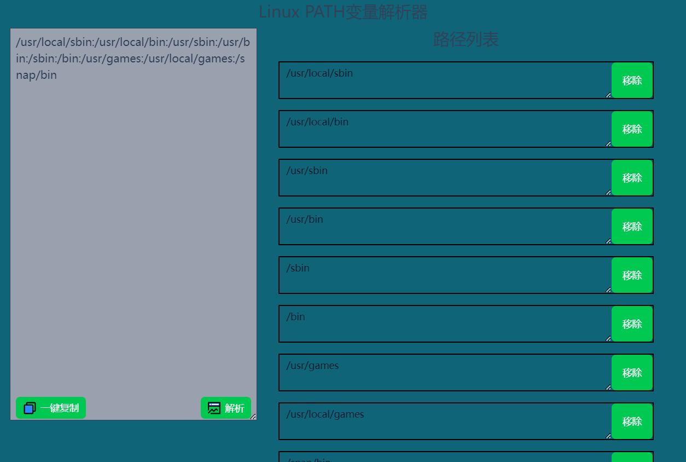

# linux-PathAnalyzer

一款linux的PATH环境变量解析器。  

## 如何使用？/Usage
https://pathanalyzer.dreamsoul.cn/  
1. 获取linux的PATH环境变量。  
```bash
echo $PATH
```
2. 在本网站的输入框中输入Path变量的值。  
3. 点击解析，路径列表下方会显示解析结果。  
4. 每一行路径都可以进行编辑，或者直接移除。  

> 由于linux添加PATH很简单，不太需要什么工具，就没有这个功能。  
```bash
export PATH=$PATH:/path/to/new/bin
```
## 功能/Features
1. 解析PATH环境变量，并将其像Windows那样做展示以供编辑。  
2. 可以编辑每个路径，编辑完成后，PATH会自动变化。  
3. 一键复制。  
## 截图



## 开发事项/Development
1. 使用pnpm作为包管理工具。  
2. npmrc中的配置是nuxtUI所需要的。  
3. 本网站托管在CloudFlare Pages，更新远程后，会自动触发部署。  
   https://dash.cloudflare.com/11371c82484f65a02bb2e4dbdccb1e1a/pages/view/linux-pathanalyzer  
### vue-clipboard3依赖存在的问题
https://www.cnblogs.com/oldsaltfish/p/18596199

## Thanks/致谢
- <a href="https://nuxt.com/">Nuxt3</a>
- <a href="https://ui3.nuxt.dev/">NuxtUI</a>
- <a href="https://icones.js.org/">icones</a>
- <a href="https://pages.cloudflare.com/">CloudFlare</a>
## 协议/License
此源代码按照许可证文件中描述的AGPL v3授权。  
This source code is licensed under the AGPL v3 as described in the LICENSE file.
